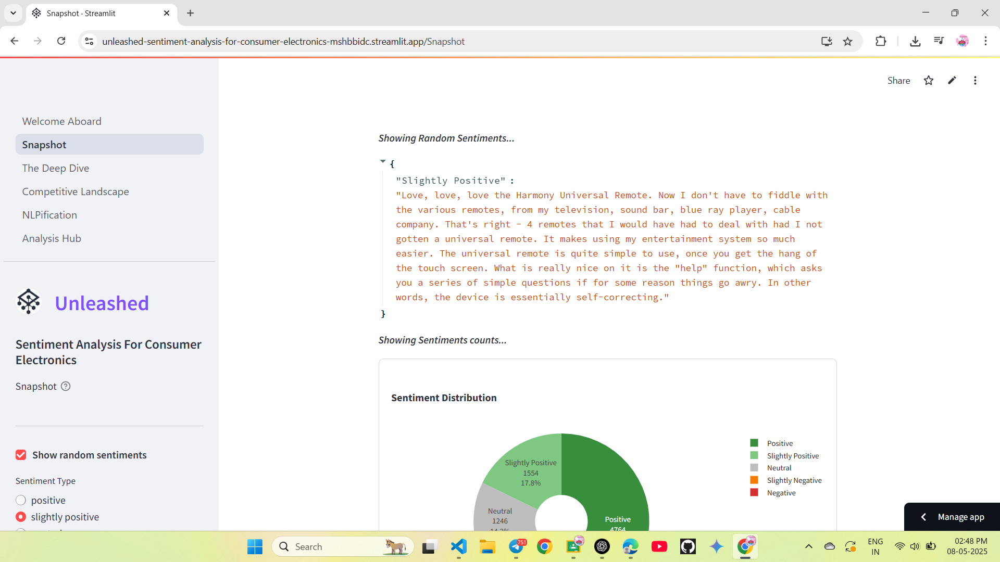
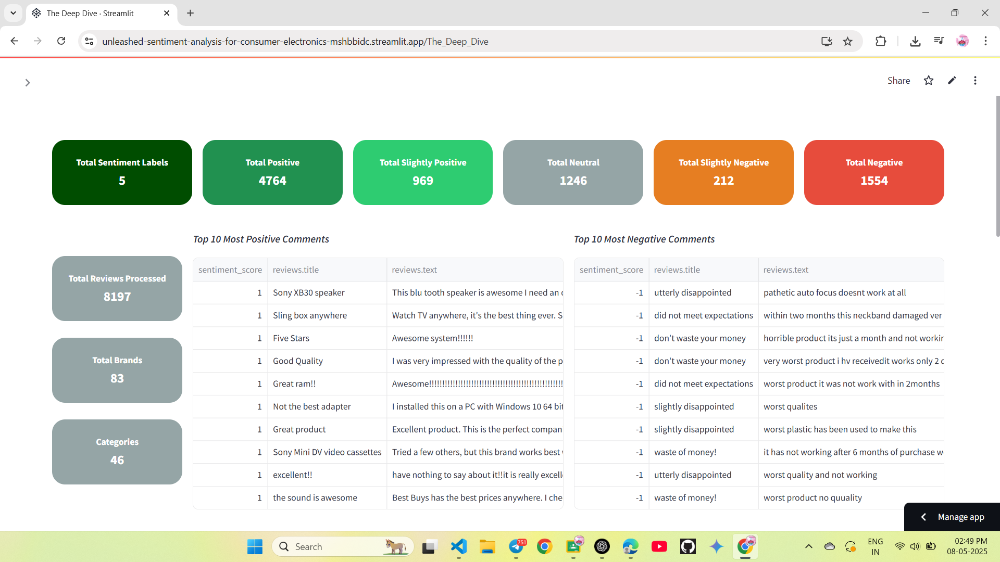
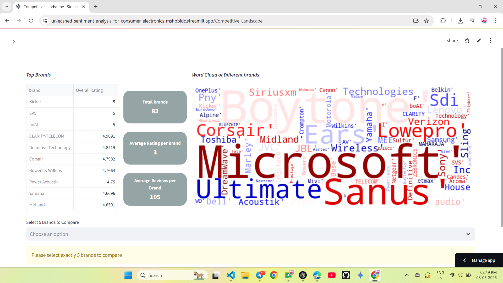
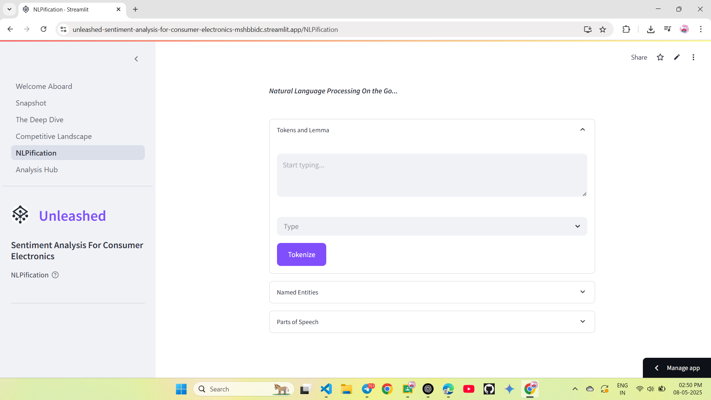
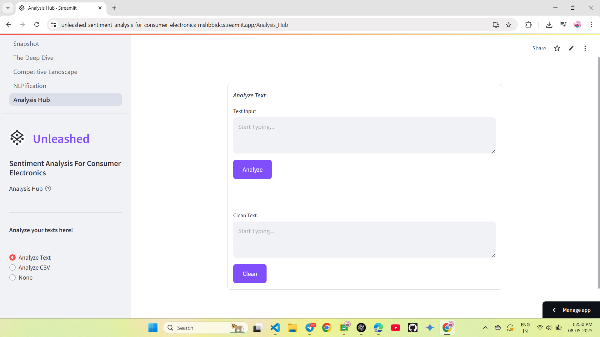

# 🔍 Unleashed: Sentiment Analysis for Consumer Electronics

Unleashed is a Streamlit-powered web app that performs **in-depth sentiment analysis** and **competitive benchmarking** of consumer electronics products using customer reviews. Designed for tech enthusiasts, product analysts, and businesses, it transforms raw feedback into actionable insights.

🌐 **Live Demo**: [Click to try the app](https://unleashed-sentiment-analysis-for-consumer-electronics-mshbbidc.streamlit.app/)
📸 **Screenshots**: See below

---

## ✨ Features
- ⭕ **Overview - Snapshot**  
  Concise overview featuring random examples, word clouds and sentiment counts

- 📊 **Detailed Sentiment Analysis - The Deep Dive**  
  Deep insights into the data providing a detailed analysis.

- 🆚 **Competitor Comparison - Competitive Landscape**  
  Compare product sentiment across competing brands in real time.

- 🧠 **NLP Operations - NLPfication**  
  Instantly receive tokenized, lemmatized, POS, and NER forms of text.

- 📈 **Analyze Text - Analysis Hub**  
  Analyze text sentiment in real-time or via CSV upload

---
##💫 Get Started - Welcome Aboard!

---
## 📷 Screenshots

| Overview | Detailed Analysis | Competitive Analysis | NLP Operations | Analyze Text |
|----------|-------------------|----------------------|----------------|--------------|
|  |  |  |  |  |

---

## 🚀 Tech Stack

- [Streamlit](https://streamlit.io/)
- [spaCy](https://spacy.io/)
- [pandas](https://pandas.pydata.org/)
- [scikit-learn](https://scikit-learn.org/)
- [NumPy](https://numpy.org/)

---

## 🛠️ Installation

```bash
# Clone the repo
git clone https://github.com/yourusername/unleashed-sentiment-analysis.git
cd unleashed-sentiment-analysis

# Install dependencies
pip install -r requirements.txt

# Run the app
streamlit run app.py
